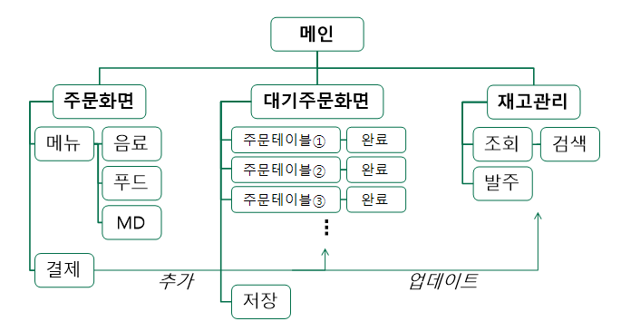
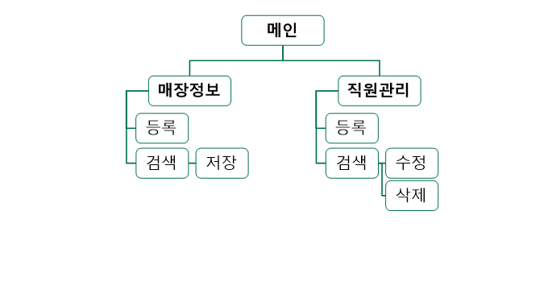

# Cafe POS
Java GUI를 활용한 카페 POS 프로그램

## 개요
- 인원 : 3명
- 기간 : '20.12/3 ~ 12/24
- [프로그램 구조 및 동작순서](.github/docs/프로그램%20구조%20및%20동작순서_201207.pdf)
- [테이블 설계서](.github/docs/테이블%20설계서_201214.pdf)

## 기술
- Java 11, Java GUI
- Oracle DB

## 기능

    
       

