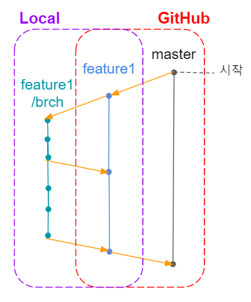

# Edu_TeamProject1_v1
국비지원교육 1차프로젝트_자바 스윙

---
## 1. Package 구조

```
* src
    ├ common : Model(DTO/VO), font
    ├ main : 메인 화면 (프레임)
    ├ order : 주문 화면 (패널)
    ├ stock : 재고관리 화면 (패널)
    └ employee : 직원관리 화면 (패널)
```
```
* main
    ├ * componet : 화면 구성시 필요한 컴포넌트들을 담아놓는 패키지
    ├ * controller : 각 컴포넌트들의 동작을 처리하는 클래스들을 담아놓는 패키지 (ex. ActionLister, MouseClickListener 등)
    ├ * view : 실제로 화면에 보여지는 화면을 구성하는 클래스들을 담아놓는 패키지 
    └ * dao (Data Access Object) : DB와 연결하여 데이터를 처리하는 클래스들을 담아 놓는 패키지
```
---
## 2. GitHub 운영 전략
- master 브랜치에서 작업하는 것이 아니라, 각자 브랜치를 만들어서 작업을 하고 해당 브랜치를 push한다.
- 각자 push용 브랜치는 별도로 관리하고, push용 브랜치에서 작업용 브랜치를 생성하여 작업용 브랜치에서 각자 작업을 한다.
- 의미 있는 변경사항이 있는 경우, push용 브랜치에 merge하고, 해당 브랜치를 push한다.
- 각 기능별 단계가 완료되면 GitHub에서 Pull Request 요청을 한다.

